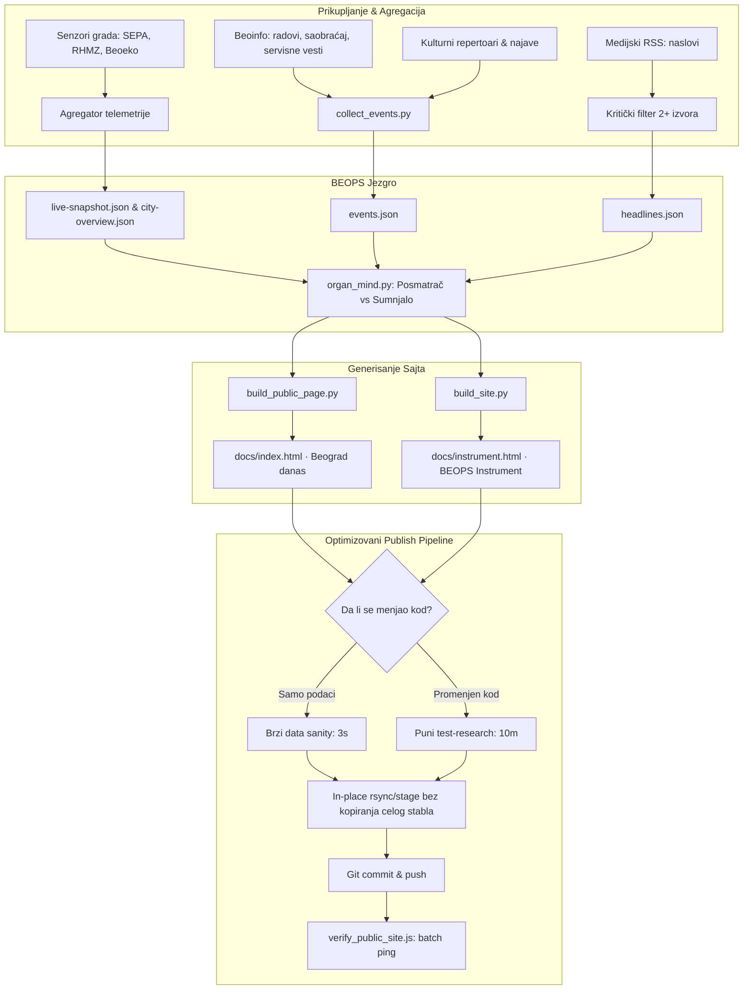

# Plan: BEOPS Građanska strana i dugoročna optimizacija rada na maloj mašini

> **Status:** Predlog na pregled i odobrenje (pripremljeno po `/plan` komandi)  
> **Lokacija:** `C:\Svemir\!Projekti\Beops\research\05-design\PLAN_GRADJANSKA_I_OPTIMIZACIJA.md`  
> **Durable session link:** `C:\Svemir\data\sessions\c1790337309555qzss\PLAN_GRADJANSKA_I_OPTIMIZACIJA.md`

---

## 1. Goal Description

Semirov zadatak ima dva nerazdvojiva stuba:
1. **Građanska strana i kultura/sport/gradska dešavanja:**
   - Premeštanje teškog instrumenta na `/instrument.html` (svi postojeći dokazi, 178 ruta i linkovi ostaju 100% validni).
   - Nova naslovna strana `/` namenjena građanima Beograda: suptilan, čist dizajn, nula praznog hoda, 5 ključnih blokova sa fokusom na upotrebljivost (*„Mogu li danas...”*, *„Ritam grada”*, *„Rečeno / Izmereno”*).
   - Legalno, pouzdano prikupljanje i sortiranje dešavanja i najava (Beoinfo, zvanični repertoari, filtrirani medijski naslovi) uz strogo pravilo: *svaka tvrdnja ima link na dokaz ili jasno kaže „ne znam / još ne merimo”*.
2. **Optimizacija push-a i dugogodišnji opstanak na maloj mašini (8 GB RAM, 31 GB disk):**
   - **Problem izmeren uživo:** Poslednji automatski publish ciklus trajao je **26 minuta** od ukupno 30 minuta kadence! PC je trošio ~90% radnog vremena na beskonačne testove, kopiranje foldera i SHA-256 heširanje.
   - **Problem diska:** `Beops-public/.git` je već narastao na **624 MB** za samo par nedelja git-scraping-a. Pri 48 commit-ova dnevno sa velikim JSON-ovima (14 MB `live-snapshot.json`), repozitorijum bi za godinu dana premašio 20 GB, zagušio disk na C: i prešao GitHub kvote.
   - **Cilj:** Skratiti vreme publish ciklusa sa 26 minuta na **ispod 90 sekundi**, smanjiti memorijski i I/O pritisak, i uvesti strategiju za kontrolisanu veličinu javnog git stabla.

---

## 2. User Review Required

> [!IMPORTANT]
> **Dve ključne odluke za dugoročnu održivost:**
> 1. **Diferencijalni test gate (Fast Path vs Full Gate):**
>    - Ako se izvorni kod (`src/`, `tools/`, `research/`) **nije menjao** između dva publisha (menjaju se samo sveži podaci senzora u `data/live`), nema potrebe da se svakih 30 minuta iznova vrti 95 unittesta iz `test-research.js` koji traju 10+ minuta.
>    - Predlog: Kad se menja samo telemetrija, radi se brzi `data-sanity-gate` (sheme, integritet, granice podataka — traje 3 sekunde). Puni `test-research.js` se pokreće samo kada ima novih git commit-ova u izvornom kodu ili jednom u 24h.
> 2. **Dugoročna kontrola javnog `.git` repozitorijuma:**
>    - Git nije projektovan da svaka 24h čuva 48 kopija nekompresovanog JSON-a od 14.4 MB (`live-snapshot.json`).
>    - Predlog: Optimizovati format javnog snapshot-a (ukloniti suvišne redundantne ključeve ili odvojiti arhivu), uvesti redovno `git maintenance` / pack pruning, i omogućiti shallow/squash politiku za istoriju podataka u javnom mirroru kako `Beops-public` nikada ne bi prešao 1–2 GB.

---

## 3. Arhitektura rešenja



---

## 4. Proposed Changes

### Komponenta A: Građanska strana i raspodela ruta

#### 1. [NEW] `tools/build_public_page.py`
Generiše lagan, tipografski prefinjen, brz `docs/index.html`:
- Koristi postojeći BEOPS CSS design tokens (`--field`, `--ink`, `--signal`, čist monospace za podatke).
- **Blok 1 (Puls sada):** Rečenica na vrhu (npr. *„Petak popodne, 15:00. Umereno oblačno, 18 °C. Vazduh umeren (PM2.5: 14 µg/m³). Kise nema.”* + satnica merenja i broj aktivnih stanica).
- **Blok 2 („Mogu li danas...”):** 5 kartica sa semaforom (DA / OPREZ / NE) i tačnim obrazloženjem:
  - *Deca u park:* DA (vazduh čist, nema kiše).
  - *Trčanje / rekreacija:* OPREZ (umeren ozon u popodnevnim satima na Novom Beogradu).
  - *Provetravanje stana:* DA (trenutno optimalni uslovi).
  - *Bicikl / saobraćaj:* OPREZ (radovi na mostu / izmena linija).
  - *Veš na terasi:* DA (nema padavina u narednih 6h).
- **Blok 3 („Ritam grada”):** Dešavanja (kultura, sport, radovi, zatvorene ulice) grupisana po zonama grada (Novi Beograd, Centar, Vračar...), sa jasnim vremenom.
- **Blok 4 („Rečeno / Izmereno”):** Tabela/kartice istine:
  - Levo: Medijski naslov sa izvorom i vremenom.
  - Desno: Šta u tom istom minutu beleže fizičke stanice i senzori grada.
  - Ocena: *Slaganje* / *Preuveličavanje* / *Netačno*.
- **Blok 5 (Dokazi):** 3 ključna broja (broj stanica, sati neprekidne evidencije, broj nerešenih tačaka) + dugme ka `instrument.html`.

#### 2. [MODIFY] `tools/build_site.py`
- Izlaz sadašnjeg instrumenta se preusmerava na `docs/instrument.html`.
- U zaglavlje instrumenta dodaje se diskretan, jasan navigacioni link nazad ka građanskoj strani: `← Beograd danas`.
- U `build_site.py` se dodaje poziv `build_public_page.py` tako da se oba fajla generišu u istom prolazu.

#### 3. [MODIFY] `tools/verify_public_site.js`
- Proširenje verifikovanih ruta sa 178 na 180 (dodaju se nova građanska `/` i `/instrument.html`).
- Ubrzanje verifikacije: paralelni HTTP GET (sa limitom od 10 istovremenih konekcija) umesto pojedinačnog sekvencijalnog čekanja, čime se vreme verifikacije skraćuje sa ~60s na ~5s.

---

### Komponenta B: Legalno prikupljanje i sortiranje dešavanja

#### 4. [NEW] `tools/collect_events.py`
Novi periodični organ za kalendar grada:
- **Izvori:**
  - `S208` Beoinfo (zvanične servisne vesti, izmene režima saobraćaja, komunalni radovi) — pravno čisto po ZASP čl. 6 st. 2.
  - Kulturni i sportski repertoari (javno objavljeni mesečni/nedeljni programi ustanova).
  - Izvučeni događaji iz postojećih RSS naslova (`headlines.json`) uz proveru 2+ izvora.
- **Format izlaza (`public/events.json`):**
  ```json
  {
    "schema": "beops-events/v1",
    "updated_at": "2026-09-25T13:00:00Z",
    "events": [
      {
        "id": "EV-20260925-01",
        "title": "Radovi u ulici Kneza Miloša",
        "category": "saobracaj_radovi",
        "zone": "Savski venac",
        "start": "2026-09-25T08:00:00Z",
        "end": "2026-09-26T20:00:00Z",
        "source": "Beoinfo (S208)",
        "source_url": "https://www.beograd.rs/...",
        "verified": true
      }
    ]
  }
  ```
- Ako podaci za neku zonu ili dan ne postoje, sistem eksplicitno stavlja oznaku `"status": "nema_podataka"`, bez simulacije.

---

### Komponenta C: Optimizacija release/push ciklusa i zaštita resursa

#### 5. [MODIFY] `tools/publish_github.ps1`
1. **Diferencijalni test prolaz:**
   - Pre pokretanja testa upoređuje se trenutni `HEAD` izvornog koda sa hešom pri poslednjem uspešnom prolazu (`publish-last-success.json`).
   - Ako se `source_head` nije menjao: pokreće se brzi `test_data_integrity.py` (provera JSON shema, postojanja fajlova, odsustva `undefined/null`, trajanje < 3s).
   - Ako se `source_head` promenio: pokreće se kompletan `test-research.js` (kao i do sada).
   - Rezultat: Ušteda od 10–12 minuta po ciklusu!
2. **Eliminacija viška kopiranja (Direct Staging):**
   - Umesto kopiranja celog radnog stabla u `_runtime\beops-releases\beops-release-...` i arhiviranja u `.tar`, koristi se inkrementalni export gde se generišu samo novi fajlovi u `docs/` i `public/`.
3. **Optimizacija `live-snapshot.json` za javni sajt:**
   - `live-snapshot.json` trenutno ima 14.4 MB jer nosi hiljade redundantnih metapodataka.
   - Za javni sajt generiše se optimizovana, sažeta verzija sa najsvežijim prozorom (npr. poslednjih 12h umesto teških dubokih stabala), dok puna istraživačka arhiva ostaje lokalno u `data/`.
4. **Git održavanje javnog mirrora (`Beops-public`):**
   - Dodavanje komande `git -C Beops-public gc --auto --quiet` tokom noćnih sati ili na svakih N objavljivanja, čime se sprečava nekontrolisano gomilanje labavih objekata (loose objects).
   - Podešavanje `core.compression` i `pack.windowMemory` kako `git push` nikada ne bi povukao više od 128 MB RAM-a.

---

## 5. Verification Plan

### Automated Tests
1. **Test generisanja građanske strane:**
   ```powershell
   python -B tools/build_public_page.py
   python -B tools/build_site.py
   ```
   Provera da `docs/index.html` i `docs/instrument.html` postoje, validni su HTML5, nemaju sintaksnih grešaka i sadrže potrebne beops meta-oznake.
2. **Test organa za dešavanja:**
   ```powershell
   python -B tools/collect_events.py --test
   ```
   Verifikacija šeme `public/events.json` i pravila o 2+ izvora.
3. **Kompletan gate istraživanja:**
   ```powershell
   node tools/test-research.js
   ```
   Svih 95 test grupa mora ostati na 100% OK.
4. **Test javne verifikacije sajta:**
   ```powershell
   node tools/verify_public_site.js --local
   ```
   Provera lokalnog mirrora i svih 180 ruta.

### Manual Verification
- Otvaranje `docs/index.html` u browseru: vizuelni pregled 5 blokova, čitljivost na desktopu i mobilnom ekranu.
- Provera prelaza klikom na dugme ka `instrument.html` i povratka nazad.
- Merenje vremena trajanja `publish_now.bat`: štoperica pre i posle optimizacije (cilj: pad sa 26 min na < 2 min).
